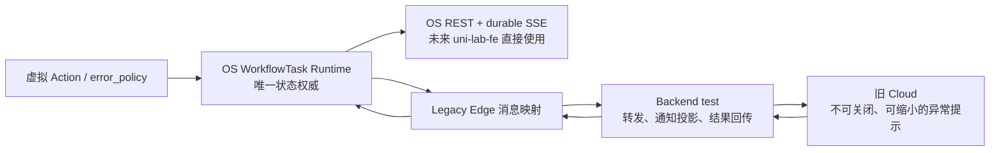

# Runtime 异常人工干预：第一版交付计划

## 1. 交付目标

在不重构旧前后端的前提下，基于以下三个确定的基线交付一条可验收的异常人工干预链路：

- `Uni-Lab-OS`: `dev@90f04339424ac2094a089ee30f9c2bfff6e050de`
- `Uni-Lab-Cloud`: `gitlab/feat/lixinyu/dev@ec6c609325eb5e2ad9ff584aa0cdabf3f6b3b6fc`
- `uni-lab-backend`: `gitlab/test@48d335b59e25c9aebc67cff4f3d2c8fd865d4443`

三个仓库均使用本地分支 `feat/runtime-error-intervention`。第一版不修改
`uni-lab-fe`，但 OS 提供的领域模型与接口必须可被未来的 `uni-lab-fe`
直接使用，不依赖旧 Cloud 或 Backend 才能成立。

第一版只以虚拟设备和虚拟流程完成真实纵向验收；不为真实设备 Action
增加交互异常策略，也不声称解决断线后物理动作状态不确定的问题。

## 2. 架构边界

边界必须满足：

1. OS Runtime 决定 Incident 是否开放、哪些选项有效、请求能否接受、Job/Task
   如何迁移以及最终结果是什么。
2. Backend 的 HTTP 成功、Redis 写入或通知已读都不代表 Resolution 已被接受。
3. 旧 Cloud 只展示 OS 投影出的状态和选项，不自行补充默认动作，不推断执行结果。
4. 旧链路是可删除的 Legacy Interaction Adapter，不形成第二套状态机。

## 3. 用户可见的信息流

### 3.1 异常出现

1. 显式配置了 `error_policy` 的虚拟 Action 抛出匹配异常。
2. OS 在同一事务边界内记录失败 Attempt、创建 `kind=action_error` 的
   WorkflowIntervention、提升 Incident revision，并将 Job 置为
   `intervention_required`、Task 控制态置为 `waiting_intervention`。
3. OS 发出持久事件。Legacy Adapter 将 Incident 投影成 Backend Notify；Backend
   通过现有 SSE 通知旧 Cloud。
4. Cloud 显示异常提示。提示不能关闭，但可以缩小；缩小后保留醒目的持久入口。
   用户可查看日志和状态，但工作流仍保持暂停。

### 3.2 用户选择动作

1. Cloud 只展示当前 Incident 提供且第一版认证的 `retry`、`skip`、`abort`。
2. 每次真实点击生成新的 `client_request_id`。同一次点击的网络重传必须复用该 ID。
3. 请求必须携带 Runtime Incident ID、revision、option ID/action 和
   `client_request_id`。旧缓存页面缺字段时 Backend 明确要求刷新，不能补造字段。
4. Backend 只记录并转发“已提交”。OS 在线时才投递；离线或投递失败立即返回
   `delivery_failed`，不把动作放入可延迟执行的 Redis 长队列。
5. OS 校验权限、Incident 状态、revision、选项、重试额度和幂等键，并原子地接受
   或拒绝请求。并发请求以 OS 第一个成功接受者为准。
6. OS 的接受/拒绝结果经 Backend 回传 Cloud。提示只在 OS 确认 resolved、
   superseded 或 Task 已终态后消失；Backend 的 pending 不能让提示消失。
7. 被拒绝的选择保持 Incident 开放，Cloud 重新取得最新状态。用户再次选择时必须
   产生新的 `client_request_id`。

## 4. 三个标准动作

### Retry

- 已接受的 retry 在原 WorkflowNodeJob 内创建新的、不可变的 Execution Attempt。
- 不复用旧 Attempt，也不复开旧 Incident。
- 新 Attempt 再次失败时创建新 Incident。
- 复用现有 `max_retries`，默认值保持 3；计数必须持久化并能跨 Runtime 重启恢复。
- 达到上限后，Runtime 不再提供 retry 选项。

### Skip

- OS 将当前 Job 规范地结束为 `skipped`，且不伪造正常输出。
- skip 不自动向下游传播；无依赖关系的分支可以继续。
- 下游若缺少必需输入，由下游 Job 创建一个新的 Input Incident，并可记录多个直接
  Incident Cause。
- 旧 Backend 暂不补齐原生 skipped 状态机；Legacy Adapter 继续编码为
  `status=success` 加 `return_info.suc_type=skip`。这一兼容编码不得回写为 OS 语义。

### Abort

- abort 永远作为 Task 级选项提供，但它只是终止意图，不承诺撤回已发设备命令。
- Runtime 停止派发新工作，等待已派发工作按现有安全边界收敛。
- 由异常干预触发的 abort 最终令 WorkflowTask 进入 `failed`，普通 cancel 仍为
  `canceled`。
- 同一 Task 的其他开放 Incident 变为 `superseded_by_task_abort`，不能记作已解决。

## 5. 各仓库改动范围

### Uni-Lab-OS：核心交付

- 将 Error Incident 落在现有 WorkflowIntervention 模型和公共接口上，不新建平行
  API、表或 `/runtime/runs` 契约。
- 补齐 Incident identity、revision、选项、Resolution、直接因果关系、Attempt 和
  journal 的持久化及原子状态转换。
- 提供并验证既有 Core 契约：
  - `GET /api/v1/workflow-interventions?status=open`
  - `POST /api/v1/workflow-interventions/{uuid}/decisions`
  - `GET /api/v1/events`
- Core SSE 只发送可重放的窄失效事件；客户端通过 REST 重取权威状态。
- 把 WorkflowTask Trigger Actor 作为一等字段记录。Legacy Backend 传入已有 Task
  UserID；未来直接入口采用 OS 认证主体。
- 复用 Manual Confirm 的身份和审计思路，不复用其 deadline，也不让旧 Backend
  拥有最终状态。
- 增加一个显式 `error_policy` 的虚拟 Action 与虚拟 Workflow 测试夹具。
- 未匹配显式策略的异常继续走普通失败路径；不新增全局 `CommunicationError` 体系。

### uni-lab-backend：薄 Legacy Adapter

- 适配 OS 当前的 Incident/Resolution 字段与旧链路现有的
  `device_exception_alarm`、decision 转发和 Notify/SSE 能力。
- 保存 Runtime Incident ID、revision、option、`client_request_id` 及 pending/result
  关联，原样透传幂等键，不根据 task/device 猜测 Incident。
- 增加 Runtime 接受/拒绝结果投影，使 Cloud 能区分 submitted、accepted、rejected
  和 delivery_failed。
- 只有 Runtime 终局结果才能关闭或更新对应通知；HTTP/Redis 成功不能提前标记完成。
- OS 离线时不排队 Resolution；保持 Incident 开放并要求重连后重新点击。
- 不全面修复旧 Backend 的 WorkflowJobSkipped 状态机，不建设通用可靠消息平台，
  不引入新的业务决策规则。

### Uni-Lab-Cloud：最小旧界面

- 复用现有 DeviceExceptionDrawer、异常 decision hook 和 Notify SSE 链路。
- 将开放 Incident 呈现为不可关闭、可缩小的提示；缩小后保留红色持久入口。
- 按服务端 options 渲染 retry/skip/abort，不在缺失 options 时自行追加 abort。
- 点击时生成并保存 `client_request_id`；同一提交的传输重试复用它。
- submitted/pending 只禁用重复提交并显示等待，不关闭提示。
- accepted/resolved/superseded/Task terminal 后关闭；rejected 时刷新并继续开放。
- 对缺少新版必需字段的旧页面显示刷新/升级提示。
- 不修改 `uni-lab-fe`，不让旧 Cloud 直连 OS。

## 6. 实施顺序

1. **OS 领域状态机与存储**：先完成原子接受、幂等、revision、Attempt、三种动作和
   重启恢复，使其不依赖旧前后端即可通过测试。
2. **OS 公共 REST/SSE 契约**：用窄事件加 REST 重取验证未来新前端路径。
3. **Backend 字段和双向 ACK 适配**：只翻译协议与维护投影，不复制 Runtime 规则。
4. **Cloud 最小交互**：在现有组件内加入不可关闭/可缩小、pending 和最终 ACK 状态。
5. **虚拟纵向验收**：使用三个目标分支贯通真实 OS、Backend 和 Cloud。

三个仓库的协议改动需要协调上线：先部署兼容新旧上行事件的 Backend，再部署 OS，
最后部署要求新字段的 Cloud。回滚 Cloud 不得发送缺字段 Resolution；若版本不兼容，
应禁用动作并提示刷新，而不是降级为猜测式提交。

## 7. 第一版验收门槛

### OS 自动化测试

- 匹配与不匹配 `error_policy` 的两条路径分别进入交互等待和普通失败。
- Incident、revision、Job/Task 状态和持久事件在一次事务中一致，SQLite 重开或
  Runtime 重启后可恢复开放 Incident。
- 同一 `client_request_id` 重放十次只产生一个结果；同 ID 不同内容拒绝第二个请求。
- 两个不同请求竞争同一 revision 时只有一个被接受，另一个获得可解释的 stale 结果。
- retry 产生同 Job 下的新 Attempt；再次失败产生新 Incident；重启后仍遵守
  `max_retries`。
- skip 不产生正常输出；缺少必需输入时下游创建新的、带直接原因的 Incident。
- abort 停止新派发，最终 Task 为 failed，并 supersede 其他开放 Incident。
- Incident 无限期开放，不因原有 300 秒默认值自动 retry/skip/abort。
- 窄 SSE 事件丢失或重连后，REST 仍能恢复完整权威状态。

### Backend 自动化测试

- 新旧字段映射和 Notify 投影正确，Runtime identity/revision/client request ID 不丢失。
- HTTP/Redis 接收不提前关闭通知；accepted/rejected ACK 才更新投影。
- Edge 离线返回 delivery_failed 且无延迟 decision 留在队列中。
- 保持旧 skip wire 编码，且不会把它当成 OS 的规范 success。
- 缺少必需字段时明确拒绝并要求刷新。

### Cloud 自动化与界面验收

- 开放提示不可关闭、可以缩小、可以从持久入口恢复。
- options、pending、accepted、rejected、superseded 和刷新提示的状态转换正确。
- 快速重复点击和网络重传不会产生多个逻辑请求。
- 页面刷新后，仍能从 Backend 的 Runtime 投影恢复开放 Incident。

### 三仓纵向验收

至少用一个虚拟 Workflow 依次验证 retry、skip、abort，并额外验证：重复提交、并发
选择、Edge 离线、OS 重启和旧页面缺字段。旧 Cloud 若没有现成浏览器 E2E 框架，
第一版不为此引入大型工具链；使用现有单元/契约测试加一条可复现的受控浏览器验收，
保留命令、关键日志与截图。

## 8. 明确不做

- 不修改 `uni-lab-fe`。
- 不给真实设备 Action 配置交互异常策略。
- 不提供“查看设备状态 / 确认已完成 / 确认未执行”等执行不确定性处理。
- 不实现物理状态查询、对账、通用 RecoveryPolicy、fallback recovery action 或命令撤回。
- 不新增全局错误码或 `CommunicationError` 基类体系。
- 不支持 custom/manual_fix 等非认证动作；线协议仍保留未来扩展能力。
- 不增加多处理人选择 UI；第一版只有 WorkflowTask Trigger Actor，未来再按实验室权限配置。
- 不修复旧 Backend 全套 skipped 终态语义，不让 Legacy Adapter 长期存在于 Core 架构中。

## 9. 迁移到 Uni-Lab-Core 的退出条件

未来 `uni-lab-fe` 接入时应直接消费本计划中的 OS WorkflowIntervention REST/SSE
契约，并删除 Cloud/Backend Legacy Adapter，而不改变以下核心语义：

- Runtime 是唯一权威；
- Incident identity、revision 和 idempotency 由端到端保留；
- retry/skip/abort 的状态转换属于 OS；
- 前端以窄 SSE 失效事件触发 REST 重取；
- Legacy Notify UUID、Redis 队列和旧 skip 编码不进入新前端契约。

若删除 Legacy Adapter 会迫使 OS 改写领域状态或新前端复刻旧 Backend 决策，则第一版
实现越过了本计划的边界，应在合并前退回调整。
